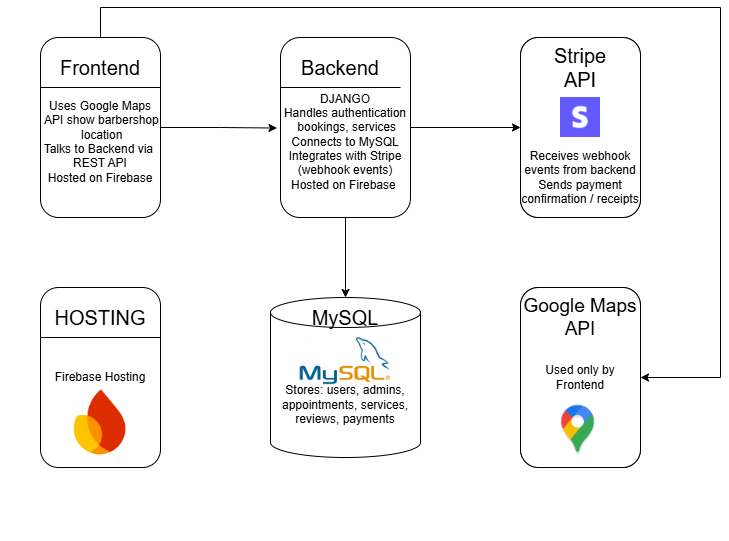
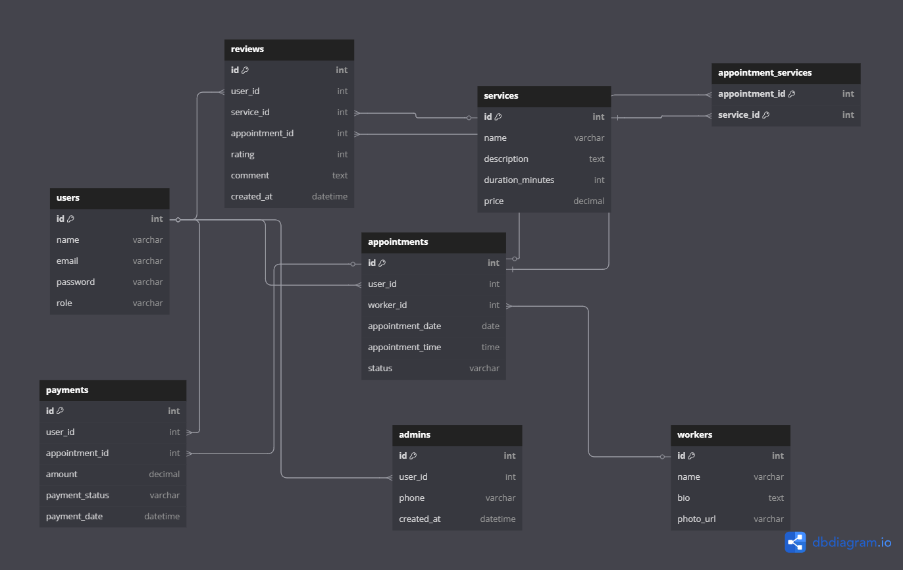
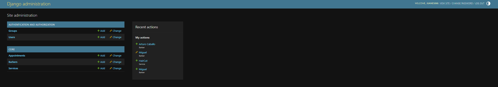
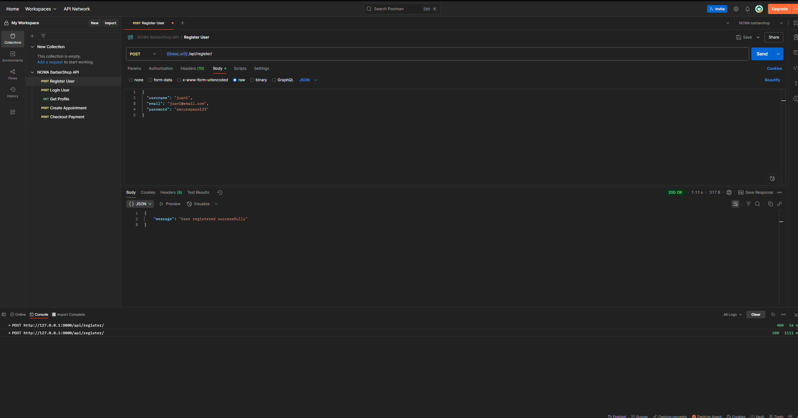
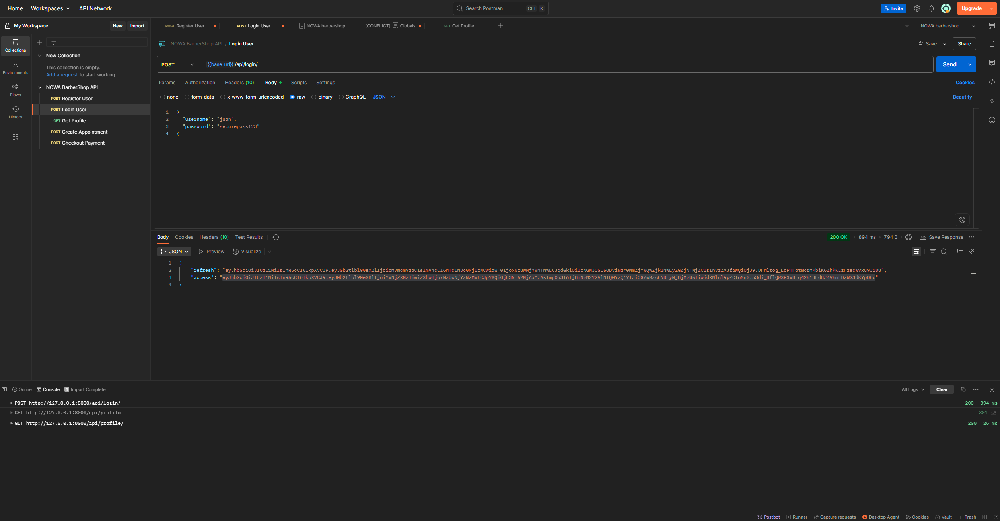
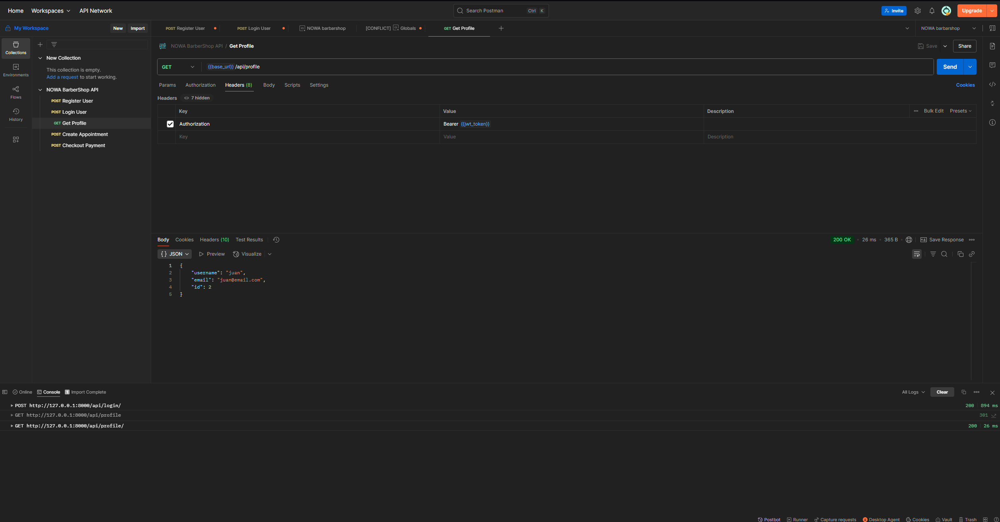
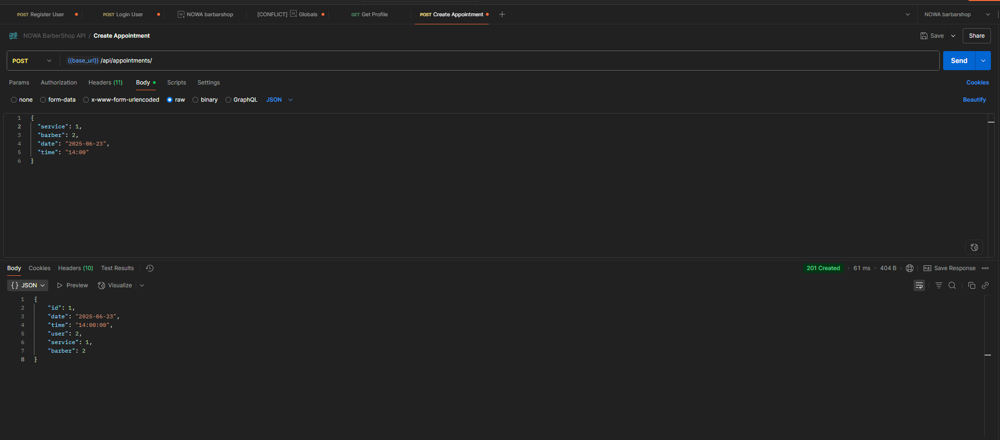
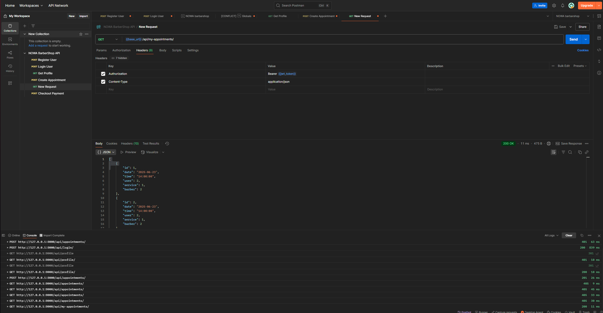
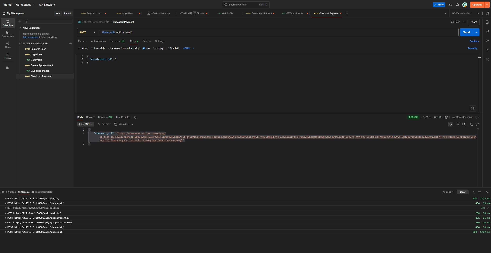
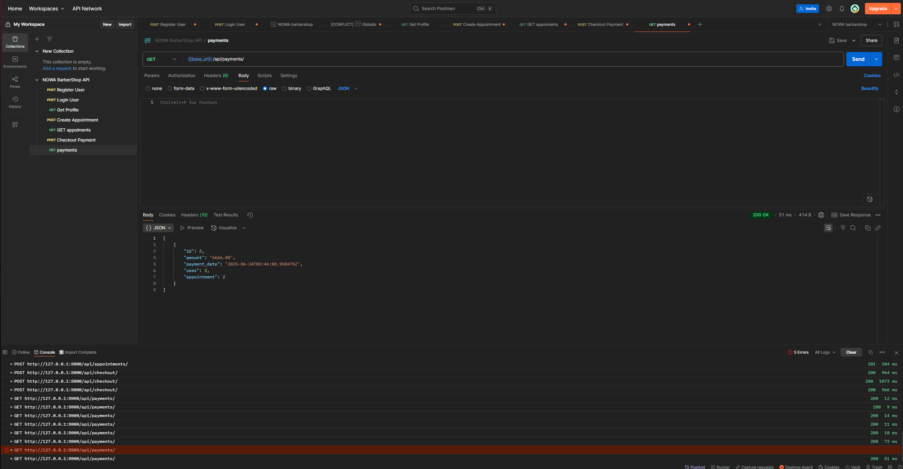

# **Capstone-Project**
## **NOWA BARBER-SHOP** 💈

### **Week 1**

1. Project Title:
- This project aims to develop a barber service booking platform that offers a smooth and user-friendly experience for customers, allowing them to view real-time availability, choose barbers, and manage appointments. At the same time, it provides barbershop owners with efficient tools to manage services, staff, and bookings with ease.
2. Problem Statement:
- The application will allow users to:

  - Register and log in as a customer or administrator.
  - Search and add services (cut, beard, eyebrows...) to their cart.
  - Select date, time and available barber.
  - Pay for the service
  - Confirm your appointment and view your history.

- Administrators will be able to:

  - Create, edit and delete services and barbers.
  - View and manage all appointments.
  - Access reports of best-selling services and daily activity.

3. Brief Overview of the Application’s Functionality:

 NOWA BARBER-SHOP is a web application where customers can view and choose differetns services (cut, beard, eyebrows...), add them to the cart, select date, time and barber, finally confirm the appointment.

4. Technology Stack

 - Frontend:
  1.  **HTML, CSS, JavaScript**
  2. **React.js** For building a dynamic and responsive user interface
  3. **Bootstrap** For responsive design and ready-to-use UI components

- Backend:
    1. **Django (Python)**  A robust web framework with built-in routing, ORM, forms, and admin panel
    2. **Authentication:**
        - django.contrib.auth for session-based login, registration, and user roles
        -Alternatively, djangorestframework-simplejwt for token-based (JWT) authentication

- Database:
    1. **MySQL**
    2. **ORM:** Django's built-in ORM

- Extras:
    1. **Email Notifications:** Using "django.core.mail" for appointment confirmations (optional)
    2. **Calendar Integration:** FullCalendar.js for selecting appointment dates and times

- Version Control:
    1. **GitHub** for version control and collaboration
- API
    1. STRIPE
    2. google maps API

4. Features

- For Clients:
    1. User registration and login
    2. Browse available services
    3. Schedule appointments (select service, date, time, and barber)
    4. View appointment history

- For Admins:
    1.Full CRUD for services and barbers
    2.Manage and edit appointments
    3. Admin dashboard with activity reports

- Routing

    1. / → Home page
    2. /login → User login
    3. /register → User registration
    4. /services → List of available services
    5. /book → Appointment booking page
    6. /payment → Payment page
    7. /dashboard → Admin dashboard (admin only)

---

### **Week 2**

1. High-Level Design
   
  * High-level architecture diagrams

  * User and administrator flows

  * Mockups
    * UI interface
  >> https://www.figma.com/design/HxMVMIfhWWMR6wQIGFG3zc/USER-INTERFACE?node-id=0-1&m=dev&t=7MsyYqLGQb9l4ElF-1

2. Database Schema Design  
   - Tables:  
     1. User  
     2. Admin  
     3. Service  
     4. Worker  
     5. Appointment  
     6. Cart  
     7. Payment  
     8. Review (feedback)  
   * Relationships
     * A User can have many Appointments
     * A Barber can handle many Appointments
     * A Service can be included in many Appointments
     * An Appointment has one Barber, one User, and one or more Services
     * A User can leave many Reviews, each linked to a Service
   * Tables (ERD)

- CRUD Operations:  
     1. USER  
        - CREATE – Sign up  
        - READ – View profile  
        - UPDATE – Edit profile  
        - DELETE – Delete account and credentials  
     2. SERVICE  
        - CREATE – Add new service  
        - READ – View services  
        - UPDATE – Edit service details  
        - DELETE – Remove service  
     3. APPOINTMENT  
        - CREATE – Client books an appointment  
        - READ – Client/Admin views appointments  
        - UPDATE – Change date, time, or status  
        - DELETE – Client or Admin cancels/deletes appointment  
     4. WORKER  
        - CREATE – Add new worker  
        - READ – View list of workers  
        - UPDATE – Edit worker profile  
        - DELETE – Remove worker  
     5. PAYMENT  
        - CREATE – When client confirms appointment (test mode with Stripe)  
        - READ – View payment records  
        - DELETE – Client deletes their payment credentials  
     6. REVIEW  
        - CREATE – Client leaves feedback  
        - READ – View reviews by service  
  3. API Endpoints, Request/Response Formats, and Authorization

The NOWA BARBER-SHOP API is a RESTful service built with Django REST Framework. It supports full CRUD operations for users, services, barbers, appointments, payments, and reviews.

### Authorization

- Uses **JWT (JSON Web Tokens)** for protected routes via djangorestframework-simplejwt.
- Required header for authenticated endpoints:

http
Authorization: Bearer <your_token_here>

### User Endpoints

| Method | Endpoint           | Description               | Auth Required |
|--------|--------------------|---------------------------|----------------|
| POST   |  /api/register/    | Create new user account   | No             |
| POST   |  /api/login/       | Login and receive token   | No             |
| GET    |  /api/profile/     | Get user profile info     | Yes            |
| PATCH  |  /api/profile/     | Update user profile       | Yes            |

**Sample Request (POST /api/register/):**

json
{
  "username": "juan",
  "email": "juan@email.com",
  "password": "securepass123"
}

**Sample Response:**

json
{
  "id": 1,
  "username": "juan",
  "email": "juan@email.com"
}

### Service Endpoints

| Method | Endpoint             | Description             | Auth Required |
|--------|----------------------|-------------------------|----------------|
| GET    |  /api/services/      | List all services       | No             |
| POST   |  /api/services/      | Create service          | Yes (Admin)    |
| PATCH  |  /api/services/{id}/ | Update service          | Yes (Admin)    |
| DELETE |  /api/services/{id}/ | Delete service          | Yes (Admin)    |

### Worker (Barber) Endpoints

| Method | Endpoint             | Description             | Auth Required |
|--------|----------------------|-------------------------|----------------|
| GET    |  /api/barbers/       | List all barbers        | No             |
| POST   |  /api/barbers/       | Add new barber          | Yes (Admin)    |
| PATCH  |  /api/barbers/{id}/  | Update barber info      | Yes (Admin)    |
| DELETE |  /api/barbers/{id}/  | Delete barber           | Yes (Admin)    |

### Appointment Endpoints

| Method | Endpoint                   | Description                    | Auth Required |
|--------|----------------------------|--------------------------------|----------------|
| GET    |  /api/appointments/        | View user/admin appointments   | Yes            |
| POST   |  /api/appointments/        | Create new appointment         | Yes            |
| PATCH  |  /api/appointments/{id}/   | Modify appointment             | Yes            |
| DELETE |  /api/appointments/{id}/   | Cancel appointment             | Yes            |

### Payment Endpoints (Stripe)

| Method | Endpoint                      | Description                        | Auth Required |
|--------|-------------------------------|------------------------------------|----------------|
| POST   | /api/checkout/                | Create Stripe checkout session     | Yes            |
| GET    | /api/payment-status/{id}/     | Retrieve payment status            | Yes            |

*Payments are handled in test mode via Stripe Test API *

### Review Endpoints

| Method | Endpoint               | Description                     | Auth Required |
|--------|------------------------|---------------------------------|----------------|
| POST   | /api/reviews/          | Submit a service review         | Yes            |
| GET    | /api/reviews/{service}/| View reviews for a service      | No             |

### Week 3, 4 & 5: Development – Backend & Frontend Implementation

### Initial migrations and superuser setup
- The developer ran "python manage.py migrate" to apply Django’s default migrations (for users, sessions, admin, etc.).
- Then, I created a superuser using "createsuperuser" to get access to the Django Admin Panel.

### Routes connection and test endpoint
- A new "core/urls.py" file was created to define the app’s internal routes.
- It was linked to the main router in "barber_backend/urls.py" using "path('api/', include('core.urls'))".
- A test route "/api/ping/" was implemented and returned a simple JSON: "{"message": "pong"}".

### User registration ("/api/register/")
- A public endpoint "POST /api/register/" was created to allow new user registration.
- The view used "User.objects.create_user()" to create users with a username, email, and password.
- CSRF checks were disabled using "@csrf_exempt" since it's consumed via Postman or external clients.

### JWT authentication ("/api/login/")
- The developer installed "djangorestframework" and "djangorestframework-simplejwt".
- JWT support was added to "settings.py" under "REST_FRAMEWORK" settings.
- The login endpoint "POST /api/login/" was added using "TokenObtainPairView", returning "access" and "refresh" tokens.

### Authenticated user profile ("/api/profile/")
- A protected route "GET /api/profile/" was added using "@permission_classes([IsAuthenticated])".
- It returns the authenticated user’s "username", "email", and "id".
- Requires sending the JWT "access" token in the "Authorization" header.

### Appointments model and creation ("/api/appointments/")
- The models "Service", "Barber", and "Appointment" were defined in "models.py".
- Migrations were generated and applied to create the related tables.
- These models were registered in the admin to be created easily through the dashboard.
- A serializer was created for the "Appointment" model.
- A secure endpoint "POST /api/appointments/" was implemented to allow users to book a service by sending "service", "barber", "date", and "time". The "user" field is automatically set using the JWT token.

## GET /api/my-appointments/
- View protected with "IsAuthenticated"
- Returns appointments ("Appointment") only for the authenticated user
- Serializer: "AppointmentSerializer"
- Tested with JWT in Postman

## POST /api/checkout/
- Integrated Stripe Checkout in test mode
- Creates a payment session for an existing "Appointment"
- Returns a "checkout_url" to the frontend
- Redirection corrected by adding "/api/success/" and "/api/cancel/" routes
- Successfully tested via Postman and browser

## GET /api/payments/
- Created the "Payment" model with fields: "user", "appointment", "amount", "payment_date"
- Created "PaymentSerializer"
- Protected view listing payments for the authenticated user
- Initially tested by manually creating a "Payment" via the admin

