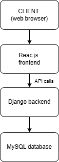
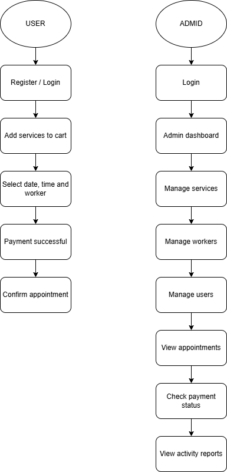
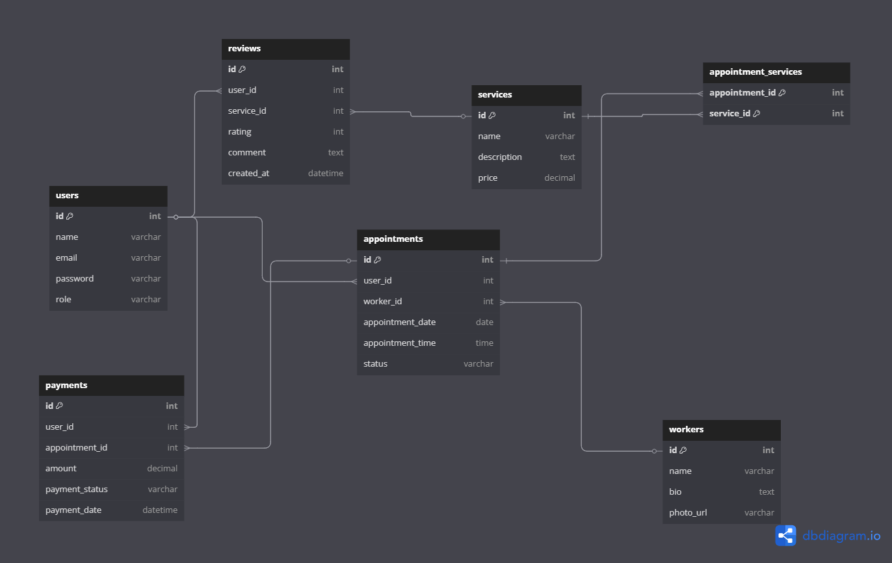

# **Capstone-Project**
## **NOWA BARBER-SHOP** 💈

### **Week 1**

1. Project Title:
- This project aims to develop a barber service booking platform that offers a smooth and user-friendly experience for customers, allowing them to view real-time availability, choose barbers, and manage appointments. At the same time, it provides barbershop owners with efficient tools to manage services, staff, and bookings with ease.
2. Problem Statement:
- The application will allow users to:

  - Register and log in as a customer or administrator.
  - Search and add services (cut, beard, eyebrows...) to their cart.
  - Select date, time and available barber.
  - Pay for the service
  - Confirm your appointment and view your history.

- Administrators will be able to:

  - Create, edit and delete services and barbers.
  - View and manage all appointments.
  - Access reports of best-selling services and daily activity.

3. Brief Overview of the Application’s Functionality:

 NOWA BARBER-SHOP is a web application where customers can view and choose differetns services (cut, beard, eyebrows...), add them to the cart, select date, time and barber, finally confirm the appointment.

4. Technology Stack

 - Frontend:
  1.  **HTML, CSS, JavaScript**
  2. **React.js** For building a dynamic and responsive user interface
  3. **Bootstrap** For responsive design and ready-to-use UI components

- Backend:
    1. **Django (Python)**  A robust web framework with built-in routing, ORM, forms, and admin panel
    2. **Authentication:**
        - django.contrib.auth for session-based login, registration, and user roles
        -Alternatively, djangorestframework-simplejwt for token-based (JWT) authentication

- Database:
    1. **MySQL**
    2. **ORM:** Django's built-in ORM

- Extras:
    1. **Email Notifications:** Using `django.core.mail` for appointment confirmations (optional)
    2. **Calendar Integration:** FullCalendar.js for selecting appointment dates and times

- Version Control:
    1. **GitHub** for version control and collaboration
- API
    1. STRIPE
    2. google maps API

4. Features

- For Clients:
    1. User registration and login
    2. Browse available services
    3. Schedule appointments (select service, date, time, and barber)
    4. View appointment history

- For Admins:
    1.Full CRUD for services and barbers
    2.Manage and edit appointments
    3. Admin dashboard with activity reports

- Routing

    1. / → Home page
    2. /login → User login
    3. /register → User registration
    4. /services → List of available services
    5. /book → Appointment booking page
    6. /payment → Payment page
    7. /dashboard → Admin dashboard (admin only)

---

### **Week 2**

1. High-Level Design
   
  * High-level architecture diagrams

  * User and administrator flows

  * Mockups
    * UI interface
  >> https://www.figma.com/design/HxMVMIfhWWMR6wQIGFG3zc/USER-INTERFACE?node-id=0-1&m=dev&t=7MsyYqLGQb9l4ElF-1

2. Database Schema Design  
   - Tables:  
     1. User  
     2. Admin  
     3. Service  
     4. Worker  
     5. Appointment  
     6. Cart  
     7. Payment  
     8. Review (feedback)  
   * Relationships
     * A User can have many Appointments
     * A Barber can handle many Appointments
     * A Service can be included in many Appointments
     * An Appointment has one Barber, one User, and one or more Services
     * A User can leave many Reviews, each linked to a Service
   * Tables (ERD)

- CRUD Operations:  
     1. USER  
        - CREATE – Sign up  
        - READ – View profile  
        - UPDATE – Edit profile  
        - DELETE – Delete account and credentials  
     2. SERVICE  
        - CREATE – Add new service  
        - READ – View services  
        - UPDATE – Edit service details  
        - DELETE – Remove service  
     3. APPOINTMENT  
        - CREATE – Client books an appointment  
        - READ – Client/Admin views appointments  
        - UPDATE – Change date, time, or status  
        - DELETE – Client or Admin cancels/deletes appointment  
     4. WORKER  
        - CREATE – Add new worker  
        - READ – View list of workers  
        - UPDATE – Edit worker profile  
        - DELETE – Remove worker  
     5. PAYMENT  
        - CREATE – When client confirms appointment (test mode with Stripe)  
        - READ – View payment records  
        - DELETE – Client deletes their payment credentials  
     6. REVIEW  
        - CREATE – Client leaves feedback  
        - READ – View reviews by service  
